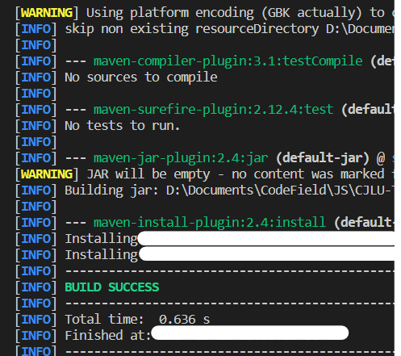
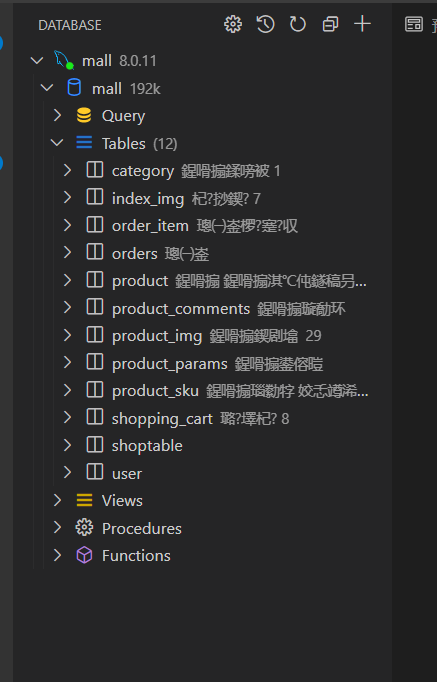
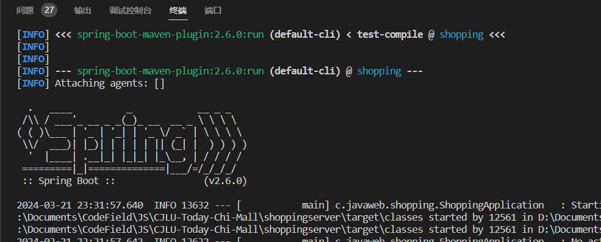

# 启动项目

- 所需环境：NodeJs、Vue、maven、JDK11、MySQL、VSCode
- 建议安装：Git（代码管理）、Navicat或者dBeaver（数据库管理），VSCode可以使用MYSQL插件

备注：
nodejs版本不能太新 我的：v16.20.2
以上环境在设置环境变量时需要将文件夹权限全部打开，以免遇到麻烦。教程网上都比较全。

## 前端

请确保安装配置好了NodeJs环境，并在`vueshopping/mall`下输入`npm install`命令，安装所需依赖，随后运行`npm run serve`命令，启动前端。

若终端出现以下信息，并且能在浏览器中成功显示[http://localhost:8081/](http://localhost:8081/)页面，说明前端启动成功

![!\[image-20230703162218089\]](pic/pic2.png)

## 后端

请确保安装配置好了NodeJs、Vue、maven、JDK11、MySQL、VSCode工具安装了MySQL插件。

1. 加载所需依赖

进入到`CJLU-Today-Chi-Mall`文件夹下运行`mvn clean install -U`命令安装所需依赖，出现以下图片说明构建成功。



2. 配置数据库

配置文件在`CJLU-Today-Chi-Mall\shoppingserver\src\main\resources\application.yml` 。

点击该文件，即可发现如下数据：

```yaml
  datasource:
    username: root
    password: 123456
    url: jdbc:mysql://127.0.0.1:3306/mall?useUnicode=true&characterEncoding=utf-8&serverTimezone=GMT%2b8&sessionVariables=sql_mode='NO_ENGINE_SUBSTITUTION'&jdbcCompliantTruncation=false&zeroDateTimeBehavior=convertToNull
    driver-class-name: com.mysql.cj.jdbc.Driver
```

请根据本地环境进行相对应的修改，以我的为例：数据库用户是`root`，用户密码是`123456`，数据库名称是`mall`。

配置好数据库后就可执行建表语句了，参考这个文件：

`CJLU-Today-Chi-Mall\shoppingserver\src\main\resources\数据库.sql`

根据SQL脚本创建完数据后，可通过数据库管理软件查看数据库。应当有这些数据表，且每个数据表中都应有相关数据（虽然我的显示是乱码）。



3. 启动后端服务

进入到`CJLU-Today-Chi-Mall\shoppingserver`文件夹下运行`mvn spring-boot:run`命令，终端出现以下图片说明后端开始运行。



## 验证

另建终端运行前端。

未运行前端的话，重新进入到`vueshopping/mall`文件夹下运行`npm run serve`启动前端。

此时可以返回前端的网页，随便点点看看是否能够操作成功：http://localhost:8081/#/index


# 顾客模块

- 登入网站
- 浏览网站内容
- 注册此网站会员
- 将选中的商品胶乳购物车
- 对购买后的商品进行评价
# 商家模块
- 注册申请开店
- 都自己的点进行管理(包括上传商品图片，对图片进行介绍等)
# 管理员模块
- 对商家进行管理
- 对系统进行维护

## 注：不需要完成真是付款/物流等功能，只需要有相关操作即可